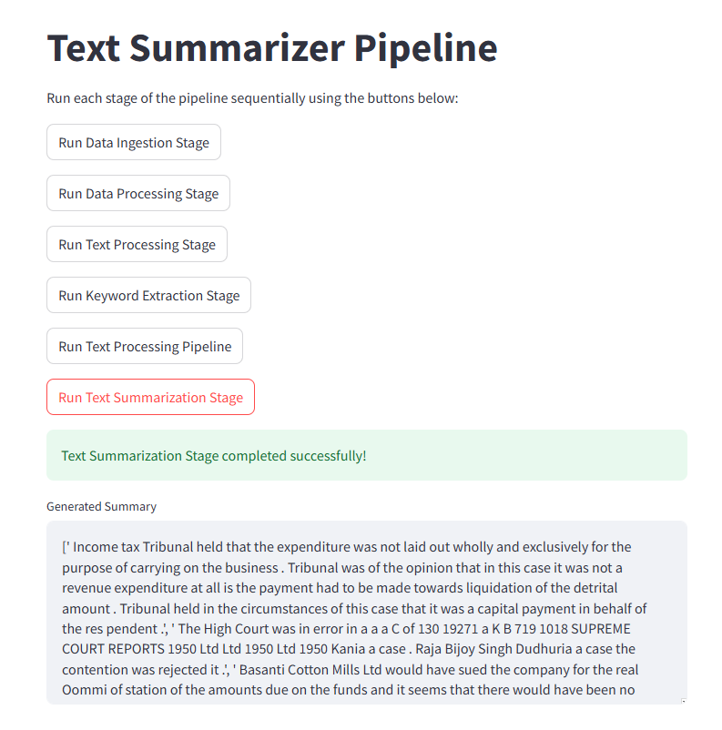

# Dynamic PDF Summarizer  

## **Overview**  
This project implements a **dynamic pipeline** for **domain-specific PDF summarization** and **keyword extraction**, optimized for concurrency and performance. The system processes multiple PDF documents, generates summaries and keywords tailored to the document's domain, and stores results in **MongoDB** in JSON format. The pipeline can handle varying document lengths—short, medium, and long PDFs—and provides error handling, logging, and scalability metrics.

---

## **Objective**  
The goal is to design a robust system that:  
1. **Ingests and processes PDFs** from a desktop folder.
2. Generates **accurate domain-specific summaries** and **non-generic keywords**.  
3. Efficiently stores results in a MongoDB database while supporting **concurrent processing**.

---

## **Features**  
1. **PDF Ingestion & Parsing**  
   - Handles multiple PDFs concurrently.
   - Supports various file sizes:
     - Short PDFs (1–2 pages).  
     - Medium PDFs (10–12 pages).  
     - Long PDFs (30+ pages).  
   - Extracts text while logging and handling corrupted or encrypted files.  

2. **Summarization & Keyword Extraction**  
   - Generates summaries tailored to document length.  
   - Extracts **domain-specific keywords** that accurately reflect document content.  

3. **MongoDB Integration**  
   - Stores metadata and raw text during ingestion.  
   - Updates database entries with JSON-formatted summaries and keywords post-processing.  

4. **Concurrency & Scalability**  
   - Leverages parallel processing for handling large batches of PDFs efficiently.  
   - Scales to high document volumes with robust error handling.  

5. **Customizable**  
   - Easy-to-update YAML configuration for pipeline tuning.  

---

## **Workflows**  
The pipeline consists of the following stages:  

1. **Data Ingestion**  
   - Reads PDFs from a specified folder.  
   - Stores document metadata (e.g., name, path, size) in MongoDB.  

2. **PDF Processing**  
   - Extracts text from PDFs while handling encryption and errors.  

3. **Text Preprocessing**  
   - Cleans extracted text for downstream processing.  

4. **Keyword Extraction**  
   - Extracts non-generic, domain-specific keywords.  

5. **Text Chunking & Embedding**  
   - Splits text into manageable chunks.  
   - Generates embeddings for semantic similarity analysis.  

6. **Summarization**  
   - Produces summaries proportional to document length and domain.  

7. **MongoDB Update**  
   - Updates MongoDB entries with JSON summaries and keywords.  

---


---

## **Setup Instructions**

### **1. Install Dependencies**
Ensure you have Python 3.9 or higher installed. Then, install the required packages:
```bash
pip install -r requirements.txt
```


###  Update Configuration
Modify `config.yaml` and `params.yaml` to set the folder path, MongoDB credentials, and other pipeline parameters.

## 3. Run the Pipeline
You can run the pipeline using either the CLI or the Streamlit app.

### CLI Workflow
```bash
# Run the pipeline
python main.py
```

### Run the Streamlit interface
```bash
streamlit run app.py
```

## **Contact**
For queries, reach out at ikshvaku24@example.com.

